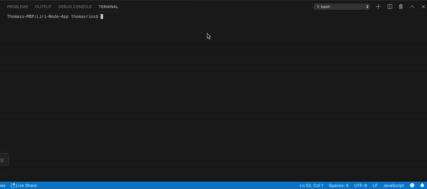
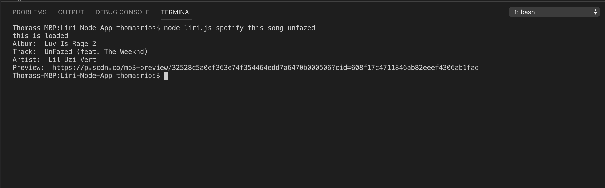
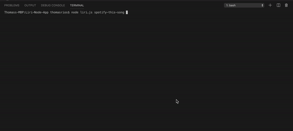

# Liri-Node-App - Thomas Rios

LIRI is a _Language_ Interpretation and Recognition Interface. LIRI is a command line node app that takes in parameters and gives you back data.

What Each Command Does

1. `node liri.js concert-this <artist/band name here>`

This will search the Bands in Town Artist Events API for an artist and render the following information about each event to the terminal: Name of the venue | Venue location | Date of the Event 

2. `node liri.js spotify-this-song '<song name here>'`

* This will show the following information about the song in your terminal/bash window

Artist(s) | The song's name | A preview link of the song from Spotify | The album that the song is from

3. `node liri.js movie-this '<movie name here>'`

* This will output the following information to your terminal/bash window:

* Title of the movie.
* Year the movie came out.
* IMDB Rating of the movie.
* Rotten Tomatoes Rating of the movie.
* Country where the movie was produced.
* Language of the movie.
* Plot of the movie.
* Actors in the movie.

