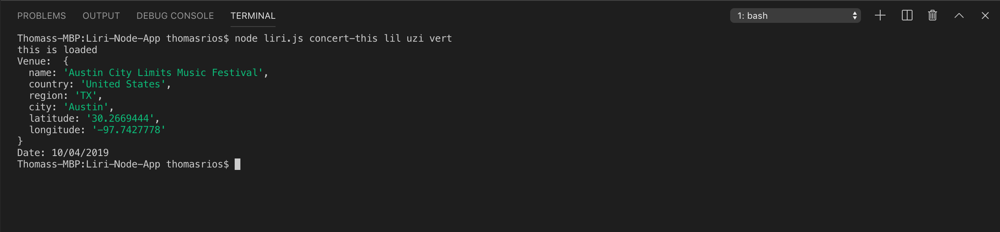

# Liri-Node-App - Thomas Rios

LIRI is a _Language_ Interpretation and Recognition Interface. LIRI is a command line node app that takes in parameters and gives you back data.

What Each Command Does

1. `node liri.js concert-this <artist/band name here>`

This will search the Bands in Town Artist Events API for an artist and render the following information about each event to the terminal: Name of the venue | Venue location | Date of the Event 

